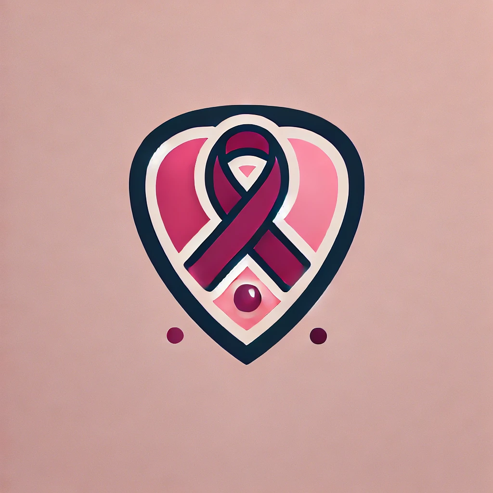

# HackForHer Health

<!-- PROJECT SHIELDS -->

[![Contributors][contributors-shield]][contributors-url]
[![Forks][forks-shield]][forks-url]
[![Stargazers][stars-shield]][stars-url]
[![Issues][issues-shield]][issues-url]
[![MIT License][license-shield]][license-url]

<!-- PROJECT LOGO -->
<br />
<div align="center">
  <a href="https://github.com/ujjwalgarg100204/HackForHer-Health">
    
  </a>

  <h3 align="center">HackForHer Health</h3>

  <p align="center">
    An All-in-One Platform for Cervical Cancer Awareness and Support
    <br />
    <a href="https://github.com/ujjwalgarg100204/hackforher-health"><strong>Explore the docs »</strong></a>
  </p>
</div>

## About The Project

HackForHer Health is a comprehensive platform dedicated to cervical cancer awareness, support, and early detection. Our mission is to empower individuals with knowledge, provide predictive tools, and facilitate seamless medical support.

### Key Features

- **Cervical Cancer Awareness**: Latest news, symptoms, FAQs, myth busters
- **Survivor Stories**: Inspiring narratives to provide hope and support
- **Predictive Model**: AI-powered cervical cancer prediction with 95-98% accuracy
- **Medical Case Management**:
  - Create and manage medical cases
  - Fill predictive questionnaires
  - Doctor case review
- **Telemedicine Features**:
  - Real-time doctor-patient communication
  - Appointment scheduling
  - Secure chat functionality

### Built With

- [![Spring Boot][Spring-Boot]][Spring-Boot-url]
- [![PostgreSQL][PostgreSQL]][PostgreSQL-url]
- [![Flask][Flask]][Flask-url]
- [![React][React.js]][React-url]

## Project Status

**Important Note**: This project is now in a completed state. No further development is planned.

## Screenshots

### Project Walkthrough


## Getting Started

### Prerequisites

Before setting up the project, ensure you have the following installed:

- Maven
- PostgreSQL Database
- Anaconda Environment
- Node.JS 20

### Installation

1. Clone the repository

   ```sh
   git clone https://github.com/ujjwalgarg100204/hackforher-health.git
   ```

2. Create sensitive.properties
   Navigate to `src/main-server/src/main/resources/` and create `sensitive.properties`:

   ```properties
   # DB configuration
   spring.datasource.url=jdbc:postgresql://localhost:5432/<db_name>?useSSL=false
   spring.datasource.username=<postgresql-username>
   spring.datasource.password=<postgresql-password>
   # Security configuration
   my.jwt.secret.key=<secret-key>
   ```

3. Create .env files

   - In `src/main-server/src/main/client/`, create `.env.development`:

     ```env
     VITE_API_BASE_URL=http://localhost:8080/api
     ```

   - Create `.env.production`:

     ```env
     VITE_API_BASE_URL=/api
     ```

4. Install dependencies

   ```sh
   # Install backend dependencies
   mvn clean install

   # Install frontend dependencies
   cd src/main-server/src/main/client
   pnpm install
   ```

5. Start the application

   ```sh
   # Start backend
   mvn spring-boot:run

   # Start model micro-service arch
   cd src/model-microservice/
   flask run
   ```

## Core Contributors

A special thank you to the core developers who made this project possible:

### Naman Rath

[](https://github.com/namanrath007)

- Machine learning model development

### Utkarsh Shukla

[](https://github.com/utkarsh-shukla2003)

- User interface design
- Documentation

## Project Completion

This project represents a comprehensive solution for cervical cancer awareness and support. While no further development is planned, the existing codebase provides a robust platform for:

- Cancer risk assessment
- Patient-doctor communication
- Medical case management
- Health awareness resources

## License

Distributed under the MIT License. See `LICENSE.txt` for more information.

## Contact

For any queries about the project, please reach out to the core contributors:

- Naman Rath: [GitHub Profile](https://github.com/namanrath007)
- Utkarsh Shukla: [GitHub Profile](https://github.com/utkarsh-shukla2003)

## Acknowledgments

- Special thanks to all who supported the HackForHer Health project
- Our dedicated healthcare professionals

---

[contributors-shield]: https://img.shields.io/github/contributors/ujjwalgarg100204/hackforher-health.svg?style=for-the-badge
[contributors-url]: https://github.com/ujjwalgarg100204/hackforher-health/graphs/contributors
[forks-shield]: https://img.shields.io/github/forks/ujjwalgarg100204/hackforher-health.svg?style=for-the-badge
[forks-url]: https://github.com/ujjwalgarg100204/hackforher-health/network/members
[stars-shield]: https://img.shields.io/github/stars/ujjwalgarg100204/hackforher-health.svg?style=for-the-badge
[stars-url]: https://github.com/ujjwalgarg100204/hackforher-health/stargazers
[issues-shield]: https://img.shields.io/github/issues/ujjwalgarg100204/hackforher-health.svg?style=for-the-badge
[issues-url]: https://github.com/ujjwalgarg100204/hackforher-health/issues
[license-shield]: https://img.shields.io/github/license/ujjwalgarg100204/hackforher-health.svg?style=for-the-badge
[license-url]: https://github.com/ujjwalgarg100204/hackforher-health/blob/master/LICENSE.txt
[Spring-Boot]: https://img.shields.io/badge/Spring_Boot-6DB33F?style=for-the-badge&logo=spring-boot&logoColor=white
[Spring-Boot-url]: https://spring.io/projects/spring-boot
[PostgreSQL]: https://img.shields.io/badge/PostgreSQL-316192?style=for-the-badge&logo=postgresql&logoColor=white
[PostgreSQL-url]: https://www.postgresql.org/
[Flask]: https://img.shields.io/badge/Flask-000000?style=for-the-badge&logo=flask&logoColor=white
[Flask-url]: https://flask.palletsprojects.com/
[React.js]: https://img.shields.io/badge/React-20232A?style=for-the-badge&logo=react&logoColor=61DAFB
[React-url]: https://reactjs.org/
